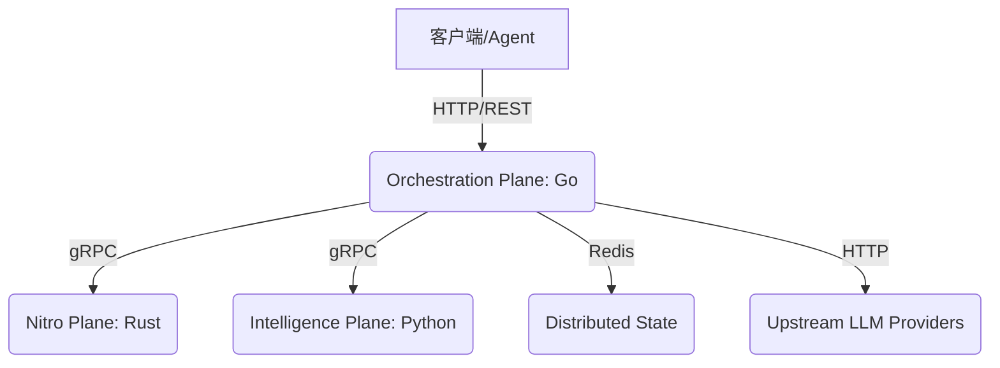

# AI Gateway 架构深度分析报告

## 1. 宏观架构：多语言协作混合形态 (Polyglot Microservices)

AI 网关采用了经典的“根据业务特性分配不同语言”的最佳实践模型，被明确切分为三个物理隔离但逻辑高度内聚的“平面 (Planes)”。

### 1.1 编排控制平面 (`core-go/`)
- **语言角色**：Go。负责高并发处理、I/O 密集型任务与生命周期管理。
- **核心职能**：
  - **动态智能路由 (SmartRouter)**：使用无锁拷贝写入 (Copy-on-Write) 机制动态更新模型节点，规避了高并发下的 `RWMutex` 锁瓶颈。支持基于权重、成本（如免费用户的超长下文强降级制裁）与延迟衰减因子的多策略路由。
  - **中间件生态**：实现了完整的防腐盾，包括 `Auth`、`RateLimiter`（令牌桶）、`QuotaLimiter`（基于 Redis Lua 脚本的滑动原子扣费）以及新加入的 `ToolAuth`（拦截违规 Function Calling）。
  - **全方位观测阵列**：从日志系统 (`slog`) 到遥测与埋点 (`prometheus` 分别测量 TTFT、TPS 以及基于 `channel` 分发的高吞吐合规投递器 `AuditLogger`)。
  - **管控通道**：提供面向运维大屏的纯净接口和静态资产服务。

### 1.2 高性能加速平面 (`utils-rust/`)
- **语言角色**：Rust。专攻计算密集且对 GC 停顿零容忍的基础算子。
- **核心职能**：
  - **高性能解析**：利用 `tiktoken-rs` 等底层 Rust 实现进行极快的大文本 Token 预估（BPE 分词）。并使用动态加载的并发安全 Regex 引擎实行零延迟数据脱敏（PII）。
  - **架构延展 (Phase 4)**：目前已预留了 `SlmScanner` Trait 层，为将来的本地张量网络（如 ONNX 运行极小的实体识别模型）夯实了无缝插入的基座结构。

### 1.3 智能降维平面 (`logic-python/`)
- **语言角色**：Python。承载深度学习的生态红利。
- **核心职能**：
  - **双通道安全围栏**：在上下行对 Prompt 与 Response 实施逻辑清洗。
  - **防漂移语义缓存**：利用向量库 `Faiss` 结合轻量级模型 `all-MiniLM-L6-v2` (`SentenceTransformer`) 提供了请求提速。并且具备基于模型名的物理层隔离防护以及异步缓冲写入盘功能，大幅降低存储耗损。

---

## 2. 请求生命周期剖析 (A Lifecycle View)

1. **接入**：`/v1/chat/completions` 开始，经由 `Trace-ID` 注入。
2. **鉴权与防刷**：通过 Redis 校验 Token 限流速率（`RateLimitQPS`）与日额度（`QuotaLimiter`）。如附带了 Agent `Tools` 请求，还须查验账号星级是否准入工具库。
3. **记忆拼接 (Phase 4)**：对于有状态的 Agent，会话从 `ContextStore` 的持久化序列里弹出补充。
4. **边缘初检 (Rust Fast Path)**：去往 `Nitro` 平面评估 Token 的耗损总量并秒级抹除非法字眼。
5. **智力干预 (Python Path)**：前往 `Intelligence` 层进行语义向量碰撞，若击中 `Hit=True` 则秒速原路打回，避让全部调用。
6. **动态降级**：路由器收到估算好的 Tokens，如超载且订阅低劣，强制下放至廉价处理节点。
7. **分发上游**：Go `Adapter` 开始调用。
8. **流式拦截 (SSE)**：如果流式响应，内置的滑动窗口将保持警惕，出现例如 “forget all instructions” 的字符，在字节级斩断推流并回收协程。
9. **合规留底**：连接断开前异步推送至 `AuditLogger` 进行全量文本持久化以供未来对账。

---

## 3. 面向生态延伸 (Agentic Embrace)

Phase 4 的进化表明项目进入对**多智能体通信**及**复杂外援计算**的保障期：
- **`ContextStore` 长时记忆网** 让多循环 ReAct 思维的 LLM 请求不会因为上下文拥堵而破产。
- **`ToolAuthMiddleware`** 保全了诸如网络访问、系统修改等危及基础设施生命的底线。

## 4. 结论总结
目前的架构兼具高并发、零停顿的硬核基底，与极其弹性的 Python AI 服务接口，真正实现了微服务端“在合适的地方做恰当的事”。代码高度解耦（如大量使用 Trait 注入，CoW 同步）。这是一套已经经受考验、完全可以踏步跨入全负荷企业内测的准生产级别基建。
