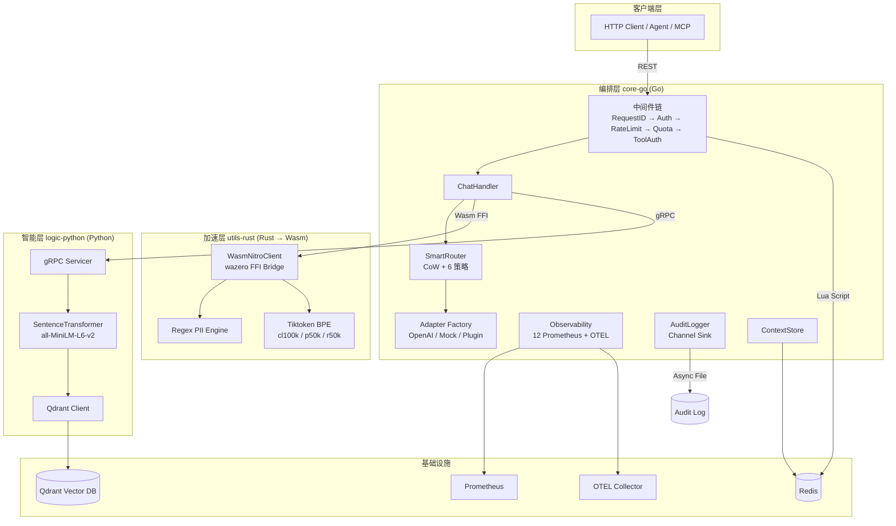

# 多语言 AI 网关：深度分析报告

> **方法论**: 头脑风暴法 (Brainstorming) + 逆向思维 (Reverse Thinking)
> **分析时间**: 2026-03-24
> **代码覆盖范围**: 44 Go 文件、1 Rust crate、1 Python 服务、Proto/CI/K8s/Docker 全量基建

---

## 一、系统全景拓扑



---

## 二、代码规模与质量指标

| 组件 | 语言 | 核心文件数 | 总代码行 | 测试文件 | 关键复杂度 |
|:--|:--|:--|:--|:--|:--|
| **core-go** | Go | 30+ | ~3,500 | 7 | [chat.go](file:///d:/workspace/codes4/gateway/core-go/internal/handlers/chat.go) (435L) 为最复杂单文件 |
| **utils-rust** | Rust | 1 | 168 | 1 | FFI 内存管理需极高精度 |
| **logic-python** | Python | 1 | 183 | 1 | Embedding 模型加载为启动瓶颈 |
| **proto** | Protobuf | 1 | 72 | - | 4 RPC 方法定义 |
| **CI/CD** | YAML | 1 | 91 | - | 3 个并行 Job |

---

## 三、设计模式深度剖析

### 3.1 亮点模式 ✅

| 模式 | 应用位置 | 分析 |
|:--|:--|:--|
| **Copy-on-Write** | [router.go](file:///d:/workspace/codes4/gateway/core-go/internal/router/router.go) | `atomic.Value` 存储节点快照，读路径零锁竞争。写端通过 [Store](file:///d:/workspace/codes4/gateway/core-go/internal/cache/context_store.go#17-21) 原子替换，真正的 lock-free 读取 |
| **Strategy Pattern** | [strategy.go](file:///d:/workspace/codes4/gateway/core-go/internal/router/strategy.go) | 6 种策略（weighted/cost/latency/quality/fallback/rule）通过 [Strategy](file:///d:/workspace/codes4/gateway/core-go/internal/router/strategy.go#6-14) 接口统一注册，支持运行时 `X-Route-Strategy` Header 动态切换 |
| **Factory + Plugin** | [provider.go](file:///d:/workspace/codes4/gateway/core-go/internal/adapters/provider.go) | [NewProvider](file:///d:/workspace/codes4/gateway/core-go/internal/adapters/provider.go#42-64) 工厂方法 + YAML 驱动的 [DynamicAdapter](file:///d:/workspace/codes4/gateway/core-go/internal/adapters/dynamic.go#28-33)，实现零编译新增供应商 |
| **Circuit Breaker** | [health.go](file:///d:/workspace/codes4/gateway/core-go/internal/router/health.go) | 三态熔断器（Closed→Open→HalfOpen）+ EWMA 延迟追踪，连续 5 次失败触发熔断 |
| **Wasm Sandbox** | [wasm_client.go](file:///d:/workspace/codes4/gateway/core-go/internal/observability/wasm_client.go) | Go-Rust 进程内 FFI，消除 gRPC 序列化开销。线性内存桥接 + 严格的 `malloc/free` 闭环 |
| **Async Audit Sink** | [audit_logger.go](file:///d:/workspace/codes4/gateway/core-go/internal/observability/audit_logger.go) | 5000 容量 Channel + 独立 Worker goroutine，非阻塞落盘，优雅关停时排空队列 |

### 3.2 逆向思维：如果这些模式失效了会怎样？

| 假设失效场景 | 影响范围 | 当前防护 | 缺口 |
|:--|:--|:--|:--|
| CoW `atomic.Value` 被高频写入 | 内存碎片化，GC 压力 | 仅管理员 API 触发写入 | ⚠️ 无写入频率限制 |
| 所有策略返回 nil | 请求无法路由 | 自动回退 `fallback`，最终兜底 `active[0]` | ✅ 三级保护完善 |
| Wasm 模块崩溃 | 整个 Nitro 层不可用 | Wasm→gRPC 自动降级 | ✅ 优雅回退 |
| 审计 Channel 满 | 日志丢失 | `select/default` 非阻塞丢弃 + error log | ⚠️ 无丢失量指标上报 |

---

## 四、安全审计（逆向思维：攻击者视角）

### 4.1 已实现的防线


### 4.2 逆向思维：攻击面清单

| # | 攻击向量 | 风险等级 | 当前状态 | 建议 |
|:--|:--|:--|:--|:--|
| 1 | **API Key 暴力穷举** | 🔴 高 | ConstantTimeCompare 防时序攻击 | ⚠️ 无登录失败锁定机制，建议对 IP 加指数退避锁 |
| 2 | **Prompt Injection** | 🟡 中 | 硬编码关键词检测 `"ignore all previous instructions"` | ⚠️ 仅覆盖英文单一变体，建议引入 ML 分类器或多语言模式库 |
| 3 | **配额绕过** | 🟡 中 | Redis Lua INCRBY 原子操作 | ⚠️ [UpdateQuotaUsage](file:///d:/workspace/codes4/gateway/core-go/internal/middleware/quota.go#75-89) 在异步 goroutine 中，若 goroutine 泄漏则配额不扣 |
| 4 | **Wasm 内存越界** | 🟢 低 | [getString](file:///d:/workspace/codes4/gateway/core-go/internal/observability/wasm_client.go#102-131) 有 10MB 读取上限 + 边界检查 | ✅ 沙箱隔离 + 防越界完善 |
| 5 | **ToolAuth 绕过** | 🟡 中 | 依赖 `key_label` 字符串比较 | ⚠️ Body 被完整读入内存再解析，超大 Body 可导致 OOM |
| 6 | **流式注入** | 🟡 中 | 100 字符滑动窗口 + 4 个关键词 | ⚠️ 窗口过小且关键词列表硬编码，可被分词绕过 |
| 7 | **审计日志篡改** | 🟢 低 | 直写文件 `O_APPEND` | ⚠️ 无文件完整性校验（如 HMAC），但 append-only 已合理 |
| 8 | **gRPC 明文传输** | 🟡 中 | `insecure.NewCredentials()` | ⚠️ 内部通讯无 TLS，K8s 内可通过 ServiceMesh mTLS 缓解 |

---

## 五、性能瓶颈深度分析

### 5.1 头脑风暴：热路径分析

请求热路径中的每一步延迟贡献：

```
客户端 → [Auth ~0.01ms] → [RateLimit ~0.5ms (Redis RTT)]
       → [QuotaLimiter ~0.5ms (Redis RTT)]
       → [ToolAuth ~0.1ms (Body 解析)]
       → [Token Count (async, 不阻塞)]
       → [GetCache ~5-50ms (gRPC + Embedding + Qdrant)]
       → [CheckInput Nitro ~0.1ms (Wasm)] 或 [~2-5ms (gRPC)]
       → [CheckInput Python ~5-20ms (gRPC)]
       → [Route ~0.01ms (CoW 无锁)]
       → [上游 LLM ~200-5000ms]
       → [CheckOutput Python ~5-20ms (gRPC)]
```

### 5.2 逆向思维：最差场景推演

| 瓶颈点 | 最差场景 | 量化影响 | 优先级 |
|:--|:--|:--|:--|
| **Python 层串行 gRPC** | Cache miss → CheckInput → Upstream → CheckOutput = 3 次 gRPC RTT | +30-60ms 额外延迟 | 🔴 P0 |
| **WasmNitroClient.mu 全局锁** | [wasm_client.go:75](file:///d:/workspace/codes4/gateway/core-go/internal/observability/wasm_client.go#L75) 所有 Wasm FFI 调用串行化 | 高并发下变为单线程瓶颈 | 🔴 P0 |
| **SentenceTransformer 推理** | `all-MiniLM-L6-v2` CPU 推理每次 ~5-10ms | 在无 GPU 环境是语义缓存的天花板 | 🟡 P1 |
| **fullResponse 字符串拼接** | [chat.go:295](file:///d:/workspace/codes4/gateway/core-go/internal/handlers/chat.go#L295) `fullResponse += content` 在长流中 O(n²) | 10K+ chunk 流时性能急剧恶化 | 🟡 P1 |
| **localLimiters 无回收** | [ratelimit.go:21](file:///d:/workspace/codes4/gateway/core-go/internal/middleware/ratelimit.go#L21) Map 只增不删 | 长期运行后内存持续增长 | 🟢 P2 |
| **ToolAuth 全量 Body 解析** | [tool_auth.go:18](file:///d:/workspace/codes4/gateway/core-go/internal/middleware/tool_auth.go#L18) `io.ReadAll` | 超大 Payload 直接吃满内存 | 🟡 P1 |

---

## 六、架构一致性审计

### 6.1 命名与组织

| 发现 | 位置 | 严重性 | 说明 |
|:--|:--|:--|:--|
| [NitroClient](file:///d:/workspace/codes4/gateway/core-go/internal/observability/observability.go#21-26) 定义在 `observability` 包 | [observability.go:21](file:///d:/workspace/codes4/gateway/core-go/internal/observability/observability.go#L21) | ⚠️ 中 | 接口与实现应属于独立的 `nitro` 包，而非 observability |
| [WasmNitroClient](file:///d:/workspace/codes4/gateway/core-go/internal/observability/wasm_client.go#18-31) 位于 `observability/` | [wasm_client.go](file:///d:/workspace/codes4/gateway/core-go/internal/observability/wasm_client.go) | ⚠️ 中 | 同上，Wasm 客户端不属于可观测性范畴 |
| [ContextStore](file:///d:/workspace/codes4/gateway/core-go/internal/cache/context_store.go#17-21) 已定义但未接入 Handler | [context_store.go](file:///d:/workspace/codes4/gateway/core-go/internal/cache/context_store.go) | ⚠️ 中 | Phase 4 代码已存在但未在 [ChatHandler](file:///d:/workspace/codes4/gateway/core-go/internal/handlers/chat.go#24-32) 中使用 |
| [docker-compose.yml](file:///d:/workspace/codes4/gateway/docker-compose.yml) 未包含 Redis/Qdrant | [docker-compose.yml](file:///d:/workspace/codes4/gateway/docker-compose.yml) | 🟢 低 | 需要额外手动启动依赖服务 |
| Proto `go_package` 路径与实际不匹配 | [gateway.proto:6](file:///d:/workspace/codes4/gateway/proto/gateway.proto#L6) vs `api/gateway/v1/` | 🟢 低 | 有两套生成代码，`github.com` 目录是冗余 |

### 6.2 逆向思维：如果要从零重建此系统，哪些设计会改变？

1. **Nitro 包独立化**: 把 [NitroClient](file:///d:/workspace/codes4/gateway/core-go/internal/observability/observability.go#21-26) / [WasmNitroClient](file:///d:/workspace/codes4/gateway/core-go/internal/observability/wasm_client.go#18-31) / `GrpcNitroClient` 从 `observability` 提取到独立的 `internal/nitro/` 包
2. **中间件 Body 流式解析**: [ToolAuth](file:///d:/workspace/codes4/gateway/core-go/internal/middleware/tool_auth.go#13-57) 不应 `ReadAll`，应使用 `json.Decoder` 流式探测 `"tools"` 字段存在性
3. **字符串拼接优化**: 流式审计中使用 `strings.Builder` 替代 `+=`
4. **Wasm 连接池化**: 创建多个 Wasm module 实例，用对象池消除 [mu](file:///d:/workspace/codes4/gateway/core-go/cmd/gateway/main.go#228-238) 全局锁
5. **配置热加载**: 当前所有配置启动时一次性加载，应支持 ConfigMap Watch 或 Signal 触发重载

---

## 七、测试覆盖度评估

| 组件 | 测试文件 | 覆盖范围 | 缺口 |
|:--|:--|:--|:--|
| Router | [router_test.go](file:///d:/workspace/codes4/gateway/core-go/internal/router/router_test.go) | 策略选择、节点过滤 | ⚠️ 熔断器状态转移未覆盖 |
| Auth | [auth_test.go](file:///d:/workspace/codes4/gateway/core-go/internal/middleware/auth_test.go) | Key 校验、格式错误 | ✅ 常见场景覆盖 |
| RateLimit | [ratelimit_test.go](file:///d:/workspace/codes4/gateway/core-go/internal/middleware/ratelimit_test.go) | 本地限流 | ⚠️ Redis 滑动窗口无集成测试 |
| Adapter | [provider_test.go](file:///d:/workspace/codes4/gateway/core-go/internal/adapters/provider_test.go), [dynamic_test.go](file:///d:/workspace/codes4/gateway/core-go/internal/adapters/dynamic_test.go) | Mock 调用 | ⚠️ OpenAI 真实 API 无契约测试 |
| Chat Handler | [chat_test.go](file:///d:/workspace/codes4/gateway/core-go/internal/handlers/chat_test.go) | 基础流程 | ⚠️ 流式 SSE + 滑动窗口审查无测试 |
| Wasm | [wasm_test.go](file:///d:/workspace/codes4/gateway/core-go/internal/observability/wasm_test.go) | 基础 FFI | ⚠️ 内存泄漏场景无验证 |
| Smoke | [smoke_test_v2_test.go](file:///d:/workspace/codes4/gateway/core-go/cmd/gateway/smoke_test_v2_test.go), [smoke_integration_test.go](file:///d:/workspace/codes4/gateway/core-go/internal/handlers/smoke_integration_test.go) | 端到端 | ⚠️ 依赖 Redis/gRPC 启动 |
| Rust | `lib.rs#tests` | BPE 初始化 | ⚠️ `#[ignore]` 标记，CI 不执行 |
| Python | [test_cache.py](file:///d:/workspace/codes4/gateway/logic-python/test_cache.py) | 缓存逻辑 | ⚠️ 无 gRPC 服务端集成测试 |

> [!WARNING]
> **流式 SSE 路径（435 行 [chat.go](file:///d:/workspace/codes4/gateway/core-go/internal/handlers/chat.go) 中最复杂的 [streamExecute](file:///d:/workspace/codes4/gateway/core-go/internal/handlers/chat.go#196-318)）几乎无自动化测试覆盖。** 这是系统中最脆弱的部分。

---

## 八、优先改进行动项

按**影响面 × 实施难度**排序的 Top 10 建议：

| # | 改进项 | 类型 | 影响 | 难度 | 建议 |
|:--|:--|:--|:--|:--|:--|
| 1 | **Wasm 连接池消除全局锁** | 性能 | 🔴 | 中 | 创建 N 个 Module 实例放入 `sync.Pool`，按需借取 |
| 2 | **流式字符串拼接优化** | 性能 | 🟡 | 低 | `strings.Builder` 替代 `+=`，几行改动即可 |
| 3 | **ToolAuth Body 限制** | 安全 | 🟡 | 低 | 加 `http.MaxBytesReader` 限制或流式探测 |
| 4 | **Prompt Injection ML 分类器** | 安全 | 🔴 | 高 | Python 层引入轻量分类模型替代硬编码关键词 |
| 5 | **Nitro 包重构** | 架构 | 🟡 | 中 | 从 `observability/` 迁移至 `internal/nitro/` |
| 6 | **流式 SSE 测试覆盖** | 质量 | 🔴 | 中 | 使用 `httptest.Server` + SSE client 端到端覆盖 |
| 7 | **localLimiters 过期回收** | 可靠性 | 🟢 | 低 | 加入 TTL 或定期清扫机制 |
| 8 | **docker-compose 补全依赖** | DevEx | 🟢 | 低 | 加入 Redis + Qdrant 服务定义 |
| 9 | **审计丢弃指标上报** | 可观测 | 🟡 | 低 | Audit drop 时递增 Prometheus counter |
| 10 | **gRPC mTLS** | 安全 | 🟡 | 中 | 或在 K8s 中通过 Istio sidecar 实现 |

---

> [!TIP]
> **最高 ROI 改动**: 第 2 项（`strings.Builder`）和第 3 项（ToolAuth Body 限制）可在 30 分钟内完成，却能分别消除 O(n²) 性能陷阱和 OOM 攻击面。
