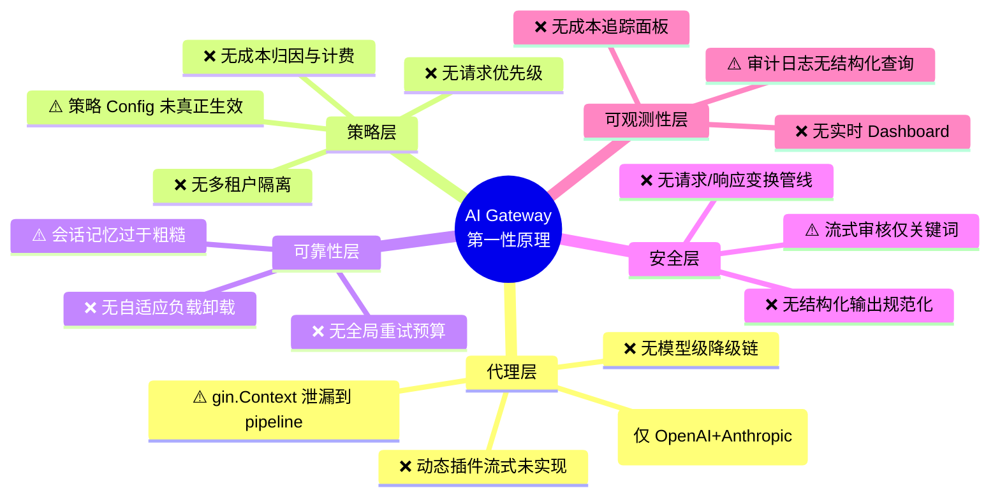
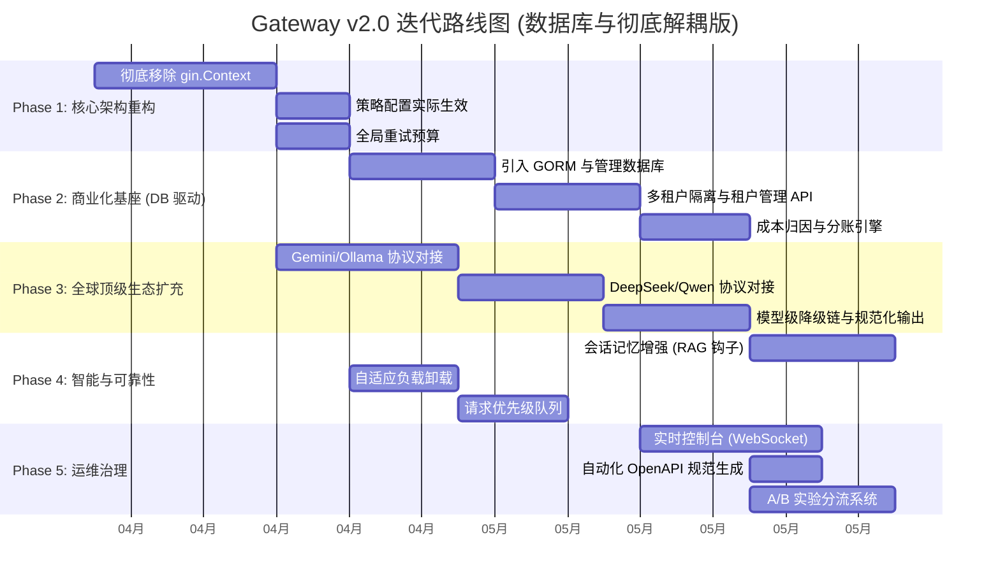

# Gateway v2.0 迭代计划

> 基于对代码库的深度探索、第一性原理分析和头脑风暴法，产出的下一版本迭代规划。

---

## 第零章：现状诊断

### 已建立的工程基础

经过深入阅读全部源码（~50 个核心文件、3 种语言、~8000 行业务代码），当前系统已具备：

| 维度 | 状态 | 关键文件 |
|------|------|----------|
| 主链路分层 | ✅ 稳定 | `handlers/chat.go` → `application/chat/service.go` → `pipeline/chat_pipeline.go` |
| 声明式策略引擎 | ✅ 具备热重载 | `pipeline/engine.go` + `configs/policies.yaml` |
| 跨语言 Facade | ✅ 统一收口 | `dependencies/facade.go` |
| 多策略路由 | ✅ 6 种策略 | `router/` (weighted, cost, latency, quality, fallback, rule) |
| 自愈熔断器 | ✅ 三态 | `router/health.go` (Closed→Open→HalfOpen) |
| Provider 协议抽象 | ✅ 可扩展 | `adapters/protocol.go` → OpenAI / Anthropic / Dynamic |
| 可观测性 | ✅ 多层次 | Prometheus 指标 + OTEL Tracing + 审计日志 |
| CI 守卫 | ✅ 全覆盖 | 架构守卫 + Proto 同步 + 三语言测试 |
| K8s 部署 | ✅ GitOps | ArgoCD + GitHub Actions |

### 从第一性原理发现的结构性缺口

> **第一性原理问题：AI 网关的本质职责是什么？**
>
> 答：**在客户端与 AI 提供者之间，以最低延迟、最高可靠性完成请求代理，同时强制执行安全、成本、合规策略，并提供完整的可观测性。**

用这个定义去逐层审视，发现当前系统在 5 个第一性维度上存在显著差距：



---

## 第一章：第一性原理分解

### 1.1 一个 AI 请求的理想生命周期

```
客户端请求
  ↓
① 接入与认证    → 谁在调用？什么权限？
② 请求标准化    → 统一为内部标准格式
③ 策略评估      → 限流、配额、合规、成本预算
④ 请求增强      → 上下文注入、提示模板、PII 脱敏
⑤ 路由决策      → 选最优 Provider + Model
⑥ 协议转换      → 内部格式 → Provider 原生格式
⑦ 执行与重试    → 调用、熔断、降级、重试（预算内）
⑧ 响应标准化    → Provider 原生 → 内部标准格式
⑨ 输出护栏      → 合规审查、敏感信息过滤
⑩ 审计与计费    → 记录、归因、成本计算
⑪ 响应返回      → SSE/JSON 输出
```

**当前系统覆盖了 ①②③⑤⑥⑦⑨⑩⑪ 共 10 步，但 ④⑧ 薄弱，③⑩ 深度不足。**

### 1.2 头脑风暴：20 项改进机会

通过不受约束的发散思考，识别出的完整改进清单：

| # | 改进项 | 影响面 | 难度 | 优先级 |
|---|--------|--------|------|--------|
| 1 | **多租户隔离** — 每个租户独立限流、配额、路由策略 | 商业化前提 | M | 🔴 P0 |
| 2 | **Provider 生态扩展** — Gemini, Mistral, Ollama, Azure OpenAI | 覆盖率 | S | 🔴 P0 |
| 3 | **成本归因与计费** — Token 按租户、模型、Provider 归因 | 商业化 | M | 🔴 P0 |
| 4 | **解耦 gin.Context** — Pipeline 不应依赖 HTTP 框架 | 架构健康 | S | 🟡 P1 |
| 5 | **动态插件流式** — DynamicProtocol 完成流式支持 | 功能完整 | S | 🟡 P1 |
| 6 | **请求增强管线** — 提示模板、上下文注入、PII 增强 | 差异化 | L | 🟡 P1 |
| 7 | **自适应负载卸载** — 根据系统压力动态调整接入率 | 稳定性 | M | 🟡 P1 |
| 8 | **全局重试预算** — 防止级联重试风暴 | 稳定性 | S | 🟡 P1 |
| 9 | **会话记忆改进** — 滑动窗口 + 摘要压缩 | 智能度 | M | 🟡 P1 |
| 10 | **实时运维 Dashboard** — WebSocket 推送的监控面板 | 运维效率 | M | 🟡 P1 |
| 11 | **模型级降级链** — GPT-4 不可用时自动降级到 GPT-3.5 | 可靠性 | S | 🟡 P1 |
| 12 | **策略配置实际生效** — policies.yaml 中的 config 字段能覆盖全局配置 | 完整性 | S | 🟢 P2 |
| 13 | **结构化输出规范化** — 跨 Provider 的 tool_call/function 统一 | 兼容性 | L | 🟢 P2 |
| 14 | **A/B 测试路由** — 按比例将流量分配到不同 Provider 做效果对比 | 实验能力 | M | 🟢 P2 |
| 15 | **流式内容 ML 审核** — 替换关键词为轻量分类模型 | 安全深度 | L | 🟢 P2 |
| 16 | **OpenAPI 文档自动生成** — Swagger/OpenAPI 3.0 spec | 开发者体验 | S | 🟢 P2 |
| 17 | **优雅降级信号传递** — 响应头中携带降级原因 | 透明度 | S | 🟢 P2 |
| 18 | **请求优先级队列** — VIP 租户请求优先处理 | 服务质量 | M | 🟢 P2 |
| 19 | **Provider 级prompt缓存** — 利用 Anthropic/OpenAI 的 prompt cache API | 成本优化 | M | 🔵 P3 |
| 20 | **WebSocket 双向通信** — 支持实时对话式交互 | 未来适配 | L | 🔵 P3 |

---

## 第二章：迭代阶段规划

基于您的反馈（引入数据库、彻底解耦、明确 Provider 优先级），计划调整如下：



---

## 第三章：各阶段详细设计

### Phase 1: 核心架构重构（约 1-1.5 周）

> **第一性原理：Pipeline 是逻辑的大脑，不应受制于 Transport 的肉身。**

#### 1.1 彻底移除 gin.Context

**执行策略**：一步到位，将 `gin.Context` 仅限制在 `handlers` 层。

**改造方案**：
- **逻辑下沉**：原本依赖 `c.Set/Get` 传递的内部状态（RequestID, KeyLabel等）全部由自定义的 `Context` 载体提取。
- **协议解耦**：`pipeline` 和 `application` 所有的接口签名全部变更为 `(ctx context.Context, request *models.ChatCompletionRequest, metadata *RequestMetadata)`。
- **容错处理**：在 handler 层完成数据的清洗与校验，确保进入逻辑层的数据是干净、结构化的。

> [!IMPORTANT]
> 这是后续所有阶段的前提。如果不完成这一步，pipeline 无法被 gRPC 入口或 WebSocket 入口复用。

#### 1.2 策略配置实际生效

**问题本质**：`policies.yaml` 中每个策略的 `config` 字段存在，但 `RateLimitPolicy` / `QuotaPolicy` 的工厂函数没有读取传入的 `cfg map[string]any`，仍然直接引用全局 `Config`。

**改造方案**：

##### [MODIFY] [policy.go](file:///d:/workspace/codes4/gateway/core-go/internal/pipeline/policy.go)
- 每个策略的工厂函数从 `cfg map[string]any` 中读取可选覆盖值
- 示例：`rate_limit` 可以在 YAML 中指定 `qps: 50`, `burst: 100`，覆盖全局默认值
- 未指定时 fallback 到全局配置

#### 1.3 全局重试预算

**问题本质**：当前每个请求独立拥有 `MaxRetries` 次重试。当 Provider 大面积宕机时，所有请求同时重试会形成「重试风暴」。

**改造方案**：

##### [NEW] [retry_budget.go](file:///d:/workspace/codes4/gateway/core-go/internal/pipeline/retry_budget.go)
- 基于令牌桶的全局重试预算：每秒补充 N 个重试令牌
- `ChatPipeline.ExecuteSync` 在发起重试前先 `AcquireRetryToken()`
- 令牌不足时直接返回失败，而不是继续重试

#### 1.4 优雅降级信号传递

**问题本质**：降级信息只记录在审计日志中，客户端无法感知。

**改造方案**：

##### [MODIFY] [service.go](file:///d:/workspace/codes4/gateway/core-go/internal/application/chat/service.go)
- 当 `result.Degraded == true` 时，在响应头中添加 `X-Gateway-Degraded: true` 和 `X-Gateway-Degrade-Reason: <reason>`
- 在 SSE 流的首个 chunk 中注入降级元数据

---

### Phase 2: 商业化基座 (DB 驱动)（约 2 周）

> **第一性原理：利用数据库建立持久化、事务性的租户管理系统，支撑高并发商业化。**

#### 2.1 引入 GORM 与管理数据库

**方案**：
- 引入 **GORM** 框架。
- 支持 **SQLite**（本地开发）与 **PostgreSQL**（生产部署）。
- 定义 `Tenants`, `APIKeys`, `Quotas`, `UsageLogs` 实体表。

#### 2.2 多租户隔离与租户管理 API
- 实现 `TenantManager` 接口，负责从 DB 加载租户配置并缓存到内存（支持失效重载）。
- 提供管理端 API：`/admin/tenants` (CRUD)。
- 租户专属配置（限流、模型白名单）直接关联到数据库记录。

#### 2.2 成本归因引擎

##### [NEW] [cost_engine.go](file:///d:/workspace/codes4/gateway/core-go/internal/pipeline/cost_engine.go)
- 维护每个 Provider/Model 的单价表（可配置）
- 在 `RecordExecutionCompleted` 时计算本次请求成本
- 按租户维度累加到 Redis：`cost:{tenant_id}:{date}`
- Prometheus 指标：`gateway_cost_total{tenant, model, provider}`

##### [NEW] [cost_policy.go](file:///d:/workspace/codes4/gateway/core-go/internal/pipeline/cost_policy.go)
- 新策略类型 `cost_budget`：当租户当日/当月成本超出预算时拒绝请求
- 注册到 `PolicyEngine`：
  ```yaml
  - name: cost_budget
    enabled: true
    config:
      enforcement: hard  # hard=拒绝, soft=警告+继续
  ```

#### 2.3 租户级策略隔离

##### [MODIFY] [engine.go](file:///d:/workspace/codes4/gateway/core-go/internal/pipeline/engine.go)
- `Evaluate` 方法接收 `tenantID` 参数
- 支持策略链的租户级覆盖：全局策略链 + 租户专属策略链合并执行

#### 2.4 计费 API 与面板

##### [NEW] [billing_handler.go](file:///d:/workspace/codes4/gateway/core-go/internal/handlers/billing_handler.go)
- `GET /admin/billing/summary` — 全局成本概览
- `GET /admin/billing/tenant/:id` — 单租户成本详情
- `GET /admin/billing/export` — CSV 导出

---

### Phase 3: 全球顶级生态扩充（约 2-2.5 周）

> **第一性原理：对接主流生态，消除 Provider 锁定风险，提供最强路由冗余。**

#### 3.1 核心 Provider 补完 (Gemini, Ollama, DeepSeek, Qwen)

- **Gemini**: 重点处理 `generateContent` 差异与多模态原生支持。
- **Ollama**: 本地私有化部署的首选。
- **DeepSeek**: 对接 DeepSeek-V3/R1 接口。
- **Qwen**: 对接通义千问 API。

#### 3.2 动态插件流式完善

##### [MODIFY] [dynamic.go](file:///d:/workspace/codes4/gateway/core-go/internal/adapters/dynamic.go)
- `DecodeStreamChunk` 实现基于 OpenAI 兼容的默认解码
- 对于非 OpenAI 兼容的插件，在 `PluginConfig` 中增加 `stream_format` 字段来选择解码器

#### 3.3 模型级降级链

##### [NEW] [fallback_chain.go](file:///d:/workspace/codes4/gateway/core-go/internal/router/fallback_chain.go)
```go
type ModelFallbackChain struct {
    Chains map[string][]string  // "gpt-4" → ["gpt-4-turbo", "gpt-3.5-turbo"]
}
```
- 当请求的目标模型所有节点不可用时，自动尝试降级链中的下一个模型
- 在路由上下文中标记 `ModelFallback: true`，供审计追踪

#### 3.4 结构化输出规范化

##### [NEW] [tool_normalizer.go](file:///d:/workspace/codes4/gateway/core-go/internal/adapters/tool_normalizer.go)
- 将网关标准 `tools` 定义转换为各 Provider 原生 function/tool 格式
- 将各 Provider 的 `tool_call` 响应转换回网关标准格式
- 覆盖 OpenAI tools、Anthropic tool_use、Gemini function_calling

---

### Phase 4: 智能增强（约 2 周）

> **第一性原理：网关不只是透明代理，它应当利用上下文主动提升请求质量。**

#### 4.1 会话记忆改进

**当前问题**：`ContextStore` 仅做 Redis 列表追加，硬编码取最后 10 条历史。

##### [MODIFY] [context_store.go](file:///d:/workspace/codes4/gateway/core-go/internal/cache/context_store.go)
- 实现滑动窗口策略：按 Token 数而非消息数限制上下文
- 新增摘要压缩：当历史超过阈值时，调用 LLM 生成摘要替代原始历史
- 支持多轮对话的「章节」切分

#### 4.2 请求增强管线

##### [NEW] [enrichment.go](file:///d:/workspace/codes4/gateway/core-go/internal/pipeline/enrichment.go)
- 可插拔的请求增强链：
  - `PromptTemplateEnricher` — 根据租户配置注入系统提示词模板
  - `ContextInjector` — 注入 RAG 检索结果或业务上下文
  - `PIIEnhancedSanitizer` — 更精细的 PII 处理（电话、地址、身份证等）
- 在 `Normalize` 之后、`EvaluatePolicies` 之前执行

#### 4.3 自适应负载卸载

##### [NEW] [load_shedder.go](file:///d:/workspace/codes4/gateway/core-go/internal/pipeline/load_shedder.go)
- 基于 Little's Law 的自适应负载卸载：
  - 监测当前在途请求数和平均延迟
  - 当 `in_flight × avg_latency > capacity_threshold` 时，开始按优先级拒绝请求
- 与请求优先级联动：先拒绝低优先级请求

#### 4.4 请求优先级队列

##### [MODIFY] [service.go](file:///d:/workspace/codes4/gateway/core-go/internal/application/chat/service.go)
- 将现有的简单 `semaphore` 替换为优先级队列
- VIP/Enterprise 租户的请求获得更高优先级
- 在高负载时，低优先级请求等待时间更长或被主动卸载

---

### Phase 5: 运维与体验（约 2 周）

> **第一性原理：无法观测的系统无法被有效运维。**

#### 5.1 实时运维 Dashboard

**当前状态**：`dashboard/index.html` 是 17KB 的静态 HTML，无实时数据。

##### [MODIFY] [dashboard/index.html](file:///d:/workspace/codes4/gateway/core-go/dashboard/index.html)
- 重写为现代化 SPA Dashboard
- 核心面板：
  - **实时流量** — QPS、延迟分布、错误率（WebSocket 推送）
  - **Provider 健康** — 每个节点的熔断状态、延迟 EWMA
  - **租户视图** — 各租户的用量、配额消耗、成本
  - **策略引擎** — 当前生效的策略链、最近拒绝原因分布
  - **会话追踪** — 按 request_id 查询完整链路

##### [NEW] [ws_handler.go](file:///d:/workspace/codes4/gateway/core-go/internal/handlers/ws_handler.go)
- WebSocket 端点 `/dashboard/ws`，推送实时指标
- 基于 `gorilla/websocket` 的广播模式

#### 5.2 OpenAPI 文档自动生成

##### [NEW] [openapi.go](file:///d:/workspace/codes4/gateway/core-go/internal/routes/openapi.go)
- 基于 `swaggo/gin-swagger` 生成 OpenAPI 3.0 spec
- 在 `/docs` 路径下暴露 Swagger UI

#### 5.3 A/B 测试路由

##### [NEW] [strategy_ab.go](file:///d:/workspace/codes4/gateway/core-go/internal/router/strategy_ab.go)
- 新路由策略 `ab_test`
- 配置示例：
  ```yaml
  experiments:
    - name: "gpt4-vs-claude"
      controlNode: "openai-primary"
      treatmentNode: "anthropic-primary"
      trafficPercent: 20
  ```
- A/B 结果自动记录到审计日志，供后续分析

#### 5.4 流式 ML 审核

##### [MODIFY] [prompt_injection.py](file:///d:/workspace/codes4/gateway/logic-python/prompt_injection.py)
- 新增轻量 ONNX 分类模型用于流式输出的实时审核
- 替代当前 `streamModerationBlacklist` 的关键词匹配

##### [NEW] [stream_moderator.go](file:///d:/workspace/codes4/gateway/core-go/internal/pipeline/stream_moderator.go)
- `GuardStreamChunk` 升级为可插拔的审核策略
- 支持本地关键词（快速）+ 远端 ML（异步增强）双层架构

---

## 第四章：架构演进总览

### 目标架构（Phase 5 完成后）

```
┌──────────────────────────────────────────────────────────┐
│                     Transport Layer                       │
│  HTTP/SSE │ WebSocket │ (future: gRPC inbound)            │
├──────────────────────────────────────────────────────────┤
│                    Application Layer                      │
│  ChatService │ BillingService │ AdminService              │
├──────────────────────────────────────────────────────────┤
│                     Pipeline Layer                        │
│  Normalize → Enrich → Policy → Plan → Execute → Guard    │
│                                                           │
│  ┌────────────┐ ┌───────────┐ ┌──────────────────┐       │
│  │PolicyEngine│ │CostEngine │ │RetryBudget       │       │
│  │ + tenant   │ │ + billing │ │ + LoadShedder    │       │
│  │   overlay  │ │ + budget  │ │ + PriorityQueue  │       │
│  └────────────┘ └───────────┘ └──────────────────┘       │
├──────────────────────────────────────────────────────────┤
│                     Router Layer                          │
│  SmartRouter + FallbackChain + A/B Strategy               │
├──────────────────────────────────────────────────────────┤
│                    Adapter Layer                           │
│  OpenAI│Anthropic│Gemini│Azure│Ollama│DynamicPlugin      │
│  ProtocolAdapter + ToolNormalizer                         │
├──────────────────────────────────────────────────────────┤
│                   Dependencies Layer                      │
│  Facade (Python Intelligence + Rust Nitro)                │
│  ContextStore (Redis) + SemanticCache (Qdrant)            │
├──────────────────────────────────────────────────────────┤
│                  Observability Layer                       │
│  Prometheus + OTEL + AuditLog + CostTracker + Dashboard   │
└──────────────────────────────────────────────────────────┘
```

### 代码量预估

| Phase | 新增文件数 | 修改文件数 | 预估新增 LOC |
|-------|-----------|-----------|-------------|
| Phase 1 | 1 | 4 | ~300 |
| Phase 2 | 4 | 3 | ~800 |
| Phase 3 | 5 | 2 | ~1200 |
| Phase 4 | 3 | 2 | ~600 |
| Phase 5 | 3 | 3 | ~1500 |
| **合计** | **16** | **14** | **~4400** |

---

## 第五章：验证计划

### 每阶段验证基线

| Phase | 自动化验证 | 手动验证 |
|-------|-----------|---------|
| Phase 1 | `go test ./...` 全通过 + 新增 pipeline 无 gin 依赖的单元测试 | 确认现有 API 行为不变 |
| Phase 2 | 新增租户隔离集成测试 + 成本计算准确性测试 | 多租户并发压测 |
| Phase 3 | 每个新 Provider 的 protocol_test.go + 动态插件流式 E2E | 真实 Provider 端到端 |
| Phase 4 | 会话记忆容量测试 + 负载卸载阈值测试 | 高并发场景下的行为验证 |
| Phase 5 | Dashboard WebSocket 连接稳定性 + OpenAPI schema 一致性 | UI 体验审查 |

### CI 扩展

- Phase 2 后新增：`tenant-isolation-test` job
- Phase 3 后新增：`multi-provider-integration-test` job
- Phase 5 后新增：`dashboard-e2e-test` job（headless browser）

---

## 第六章：风险与缓解

| 风险 | 影响 | 缓解措施 |
|------|------|----------|
| Phase 1 解耦 gin.Context 导致大面积回归 | 高 | 先建立充分的 pipeline 层测试覆盖，再做解耦 |
| 多租户引入后配置复杂度急增 | 中 | 提供合理默认值 + 配置校验 + 逐步迁移路径 |
| 新 Provider 协议理解偏差 | 中 | 每个 Protocol 必须配套 `protocol_xxx_test.go` |
| 成本计算精度与 Provider 账单不一致 | 中 | 明确标注为"估算"，提供校准接口 |
| Dashboard 重写工作量大 | 低 | 可渐进式：先做数据 API，再做 UI |

---

## Open Questions (已解决)

- **Q1**: 优先级是否符合？ **A**: 符合，已锁定。
- **Q2**: 租户模型？ **A**: 彻底转为数据库驱动，引入 GORM。
- **Q3**: gin.Context 移除？ **A**: 一步到位，彻底重构逻辑层。
- **Q4**: Provider 优先级？ **A**: Gemini > Ollama > DeepSeek > Qwen。
